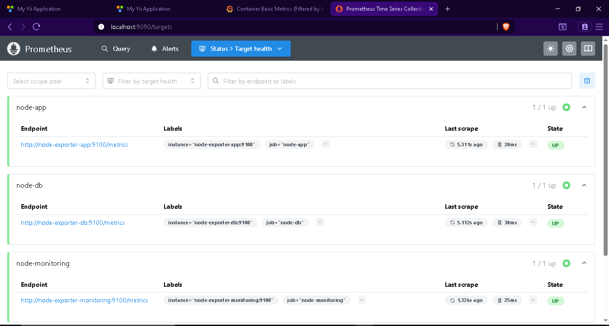
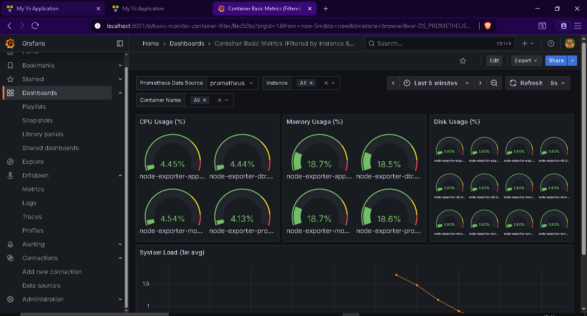
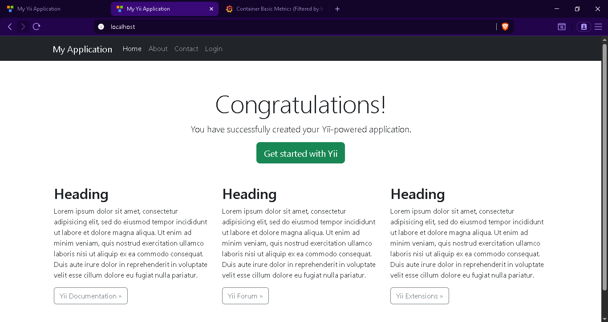
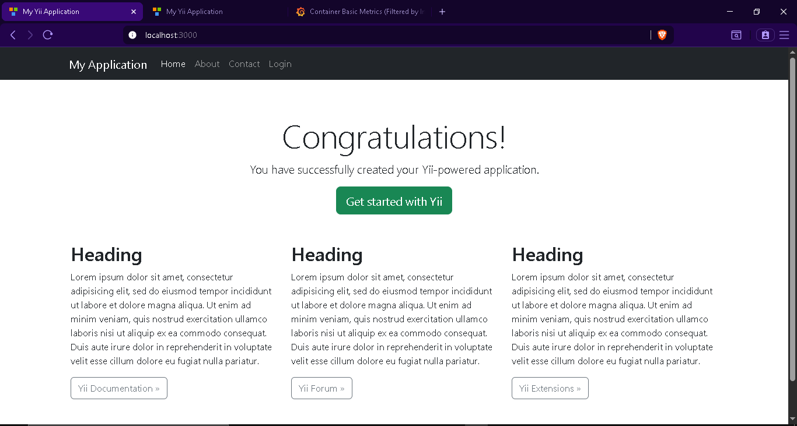

---

````markdown
# 🧩 SkillTest DevOps — All Docker Containers

This repository provides a complete **DevOps environment** for a PHP **Yii2 web application**, **PostgreSQL database**, **Nginx reverse proxy**, and a **Monitoring stack** using **Prometheus** and **Grafana**.  
The setup is designed to be **modular**, **simple**, and aligned with **production-ready best practices**, making it ideal for technical assessments and proof-of-concept environments.

---

## 🚀 How to Setup

### Prerequisites
Ensure you have the following installed on your system:
- Docker Engine ≥ 24.x  
- Docker Compose Plugin ≥ 2.x  
- Bash / WSL / Linux Terminal  

### Quick Start
To spin up all containers at once, simply execute:

```bash
sh easy-on.sh
````

This command will:

* Deploy PHP-FPM (runtime for Yii2)
* Run Nginx as a reverse proxy
* Set up PostgreSQL as the backend database
* Initialize Prometheus, Grafana, and Node Exporters for monitoring

---

## 🧹 How to Destroy All Containers

To clean up and stop all running containers:

```bash
sh easy-down.sh
```

This command will gracefully remove all containers, networks, and volumes created during setup.

---

## 📊 Monitoring Access (Grafana)

Grafana is used to visualize container metrics such as CPU, memory, and disk usage.

**Access URL:**
[http://localhost:3001](http://localhost:3001)

**Default Login Credentials:**

```
Username: admin
Password: admin
```

### Prometheus Target Status

Prometheus scrapes metrics from each container via Node Exporter:



---

### Grafana Dashboard — Container Metrics Overview

Displays key performance indicators:

* CPU Usage (%)
* Memory Usage (%)
* Disk Usage (%)



---

## 🌐 Web Application

After setup, the Yii2 application can be accessed at:

* **Application via Reverse Proxy (Nginx):** [http://localhost](http://localhost)
* **Application Direct (PHP-FPM):** [http://localhost:3000](http://localhost:3000)

### ✅ Nginx Reverse Proxy Working View



---

### ✅ Yii2 Application Default Page



---

## 🧠 Summary

| Component           | Description                  | Port |
| ------------------- | ---------------------------- | ---- |
| Yii2 App (PHP-FPM)  | Core web application runtime | 3000 |
| Nginx Reverse Proxy | Routes web traffic           | 80   |
| PostgreSQL          | Application database         | 5432 |
| Prometheus          | Metrics collection service   | 9090 |
| Grafana             | Visualization dashboard      | 3001 |
| Node Exporter       | Container resource metrics   | 9100 |

---

## 📘 Notes

* The configuration aims to be simple and production-aligned without overengineering.
* All containers are connected through a shared Docker network for isolation and monitoring visibility.
* Each service can be extended or replaced modularly without impacting others.

---

**Author:** Risky Rainaldi
**Role:** DevOps Engineer
**Stack:** Docker, PHP-FPM, Nginx, PostgreSQL, Prometheus, Grafana